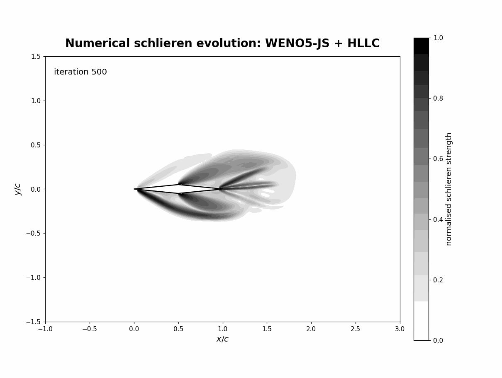

# Supersonic Diamond Airfoil CFD at Mach 2.5

**From compressible-flow theory to a custom C++ shock-capturing solver and an ongoing wall-resolved SA-RANS study**

This project studies a two-dimensional diamond airfoil at Mach 2.5 and 5° angle of attack.

The geometry creates a clear system of compression waves, oblique shocks and Prandtl-Meyer expansions. This makes it a useful case for checking whether a numerical solution recovers the physics predicted by classical compressible-flow theory [1].

I developed a custom C++ finite-volume Euler solver using HLLC intercell fluxes [2,3], WENO5-JS reconstruction [4] and SSP-RK3 time integration [5]. The airfoil is represented on a Cartesian grid using an immersed-boundary treatment [12].

## Numerical development of the wave field

<p align="center">
  
</p>

<p align="center">
  <em>Evolution of the numerical schlieren field from the initial transient towards the established Mach 2.5 shock-expansion structure.</em>
</p>

I do not accept a solution only because lift and drag become stable.

I also check the shock angles, Rankine-Hugoniot states, Prandtl-Meyer expansion states, surface pressure, off-body wave structure and integrated aerodynamic forces against independent analytical references [1].

> **Main engineering question:**  
> Does the same aerodynamic conclusion survive when the modelling fidelity is increased?

---

## 1. Why this problem?

A diamond airfoil is simple geometrically, but the flow physics are not.

At supersonic speed, each change in surface direction creates either a compression or an expansion.

For this case:

- the leading edges generate attached oblique shocks;
- the mid-chord corners generate expansion waves;
- the upper and lower surfaces experience different pressure states because the airfoil is at 5° incidence;
- those pressure differences create lift, wave drag and pitching moment.

The important advantage is that these states can be calculated independently using oblique-shock and Prandtl-Meyer theory [1].

That gives me a reference outside the CFD solver.

The solver therefore has to do more than produce a smooth-looking flow field. It has to recover the correct wave system and produce aerodynamic forces that are consistent with that physics.

---

## 2. Reference case

| Quantity | Value |
|---|---:|
| Geometry | 2D diamond airfoil |
| Chord, `c` | 1.0 m |
| Thickness ratio, `t/c` | 0.10 |
| Freestream Mach number | 2.5 |
| Angle of attack | 5° |
| Ratio of specific heats, `γ` | 1.4 |
| Gas constant, `R` | 287 J kg⁻¹ K⁻¹ |
| Freestream pressure | 101325 Pa |
| Freestream temperature | 288.15 K |
| Freestream velocity | 850.657 m/s |
| Euler reference grid | 720 × 360 |
| RANS chord Reynolds number | approximately 5.82 × 10⁷ |

---

## 3. Solver development

### 3.1 Euler formulation

The inviscid branch solves the two-dimensional compressible Euler equations in conservative form,

```math
\frac{\partial \mathbf{U}}{\partial t}
+
\frac{\partial \mathbf{F}}{\partial x}
+
\frac{\partial \mathbf{G}}{\partial y}
=0,
```
### 3.2 Why I moved beyond Rusanov
Rusanov was useful as a robust starting point.

It uses a single maximum signal speed and adds relatively strong numerical dissipation. This makes it simple and stable, but the same dissipation can smear shocks and contact structures [2].

My earlier compressible-flow studies showed this behaviour directly. Rusanov remained robust, while HLLC recovered discontinuous wave structure more accurately.

For this airfoil, that difference matters.

The pressure change across each wave contributes directly to the aerodynamic force. If the numerical method smears the shock too strongly, it can also change the surface pressure and therefore the predicted wave drag and lift.

So I moved to HLLC.

---

### 3.3 HLLC flux

HLLC restores the intermediate contact wave that is missing from the simpler two-wave HLL representation [2,3].

The approximate wave system contains

```math
S_L,\qquad S_*,\qquad S_R.
```
### 3.4 Barth-Jespersen reconstruction

Before moving to WENO5-JS, I developed an HLLC solver using Barth-Jespersen limited reconstruction [6].

The limiter allows higher-order reconstruction in smooth regions, but reduces the reconstruction close to strong gradients where non-physical oscillations can appear.

This gave me an important intermediate solver:

**HLLC + Barth-Jespersen**

I used this branch to check the HLLC flux, pressure field, force integration and convergence behaviour before adding the more expensive WENO5-JS reconstruction.

The final integrated lift and drag from this branch were effectively the same as the later WENO5-HLLC solution.

That was useful evidence: changing the reconstruction changed the local numerical treatment, but did not change the final aerodynamic loading at the reported precision.

### 3.5 Why WENO5-JS?

The flow contains two very different numerical regions.

In smooth parts of the domain, I want high-order accuracy.

Across shocks, the solution is discontinuous and a normal high-order reconstruction can create non-physical oscillations.

WENO5-JS handles this by reconstructing the solution from several candidate stencils. In smooth regions, the stencils combine to recover fifth-order accuracy. Close to a discontinuity, the nonlinear weights reduce the influence of stencils that cross the shock [4].

For this problem, that matters because I need to preserve:

- the leading-edge compression waves;
- the sharp pressure rise across the oblique shocks;
- the mid-chord expansion structure;
- the pressure distribution that produces wave drag and lift.

I therefore moved from the limited HLLC branch to WENO5-JS when the improvement in local wave resolution justified the additional computational cost.

The final Euler solver uses:

```text
Finite-volume conservation
        ↓
WENO5-JS reconstruction
        ↓
HLLC intercell flux
        ↓
SSP-RK3 time integration
```

## 4. WENO5-HLLC flow field

The final Euler solution recovers the expected asymmetric supersonic wave system.

At the leading edge, both surfaces turn the flow towards the body and create attached oblique shocks.

Because the airfoil is at 5° angle of attack, the effective turning angle is different on the two sides:

- the lower forward surface produces the stronger compression;
- the upper forward surface produces the weaker compression.

The pressure rise is therefore much larger on the lower forward panel.

At the mid-chord corners, the surfaces turn away from the local flow. The compressed flow then expands through Prandtl-Meyer fans before leaving the trailing edge.

This creates the main aerodynamic loading pattern:

**strong lower-surface compression + upper-surface pressure reduction → positive lift**

while the streamwise component of the pressure loading produces wave drag.

The important point is that I do not start by looking at the final `C_D` and `C_L`.

I first ask whether the solver has produced the correct physical wave system.

> **A correct force coefficient with the wrong shock or expansion structure would not be an acceptable solution.**

The next checks therefore compare the numerical wave field directly with analytical compressible-flow theory.

---

## 5. Verification against compressible-flow theory

I use several independent checks because no single CFD quantity is enough to prove that the full solution is physically correct.

The first check is the leading-edge shock geometry.

### 5.1 Leading-edge shock verification

For the symmetric diamond geometry,

```text
thickness ratio, t/c = 0.10
half angle, δ         = atan(0.10)
                      ≈ 5.71 deg
```

At `α = 5°`, the upper and lower forward panels experience different effective compression turns:

```text
upper surface turning angle ≈ 0.71 deg
lower surface turning angle ≈ 10.71 deg
```

The lower surface therefore produces the substantially stronger leading-edge compression.

The weak-shock solution of the `θ-β-M` relation gives:

| Surface | Turning angle, `θ` | Shock angle, `β` |
|---|---:|---:|
| Upper forward panel | 0.71° | 24.09° |
| Lower forward panel | 10.71° | 32.53° |

The shock-angle prediction provides the first analytical check on the numerical wave structure.

The corresponding Rankine-Hugoniot states are:

| Quantity | Upper shock | Lower shock |
|---|---:|---:|
| `θ` | 0.71° | 10.71° |
| `β` | 24.09° | 32.53° |
| `Mn1` | 1.020 | 1.344 |
| `p2/p1` | 1.048 | 1.942 |
| `ρ2/ρ1` | 1.034 | 1.593 |
| `T2/T1` | 1.014 | 1.219 |
| `M2` | 2.470 | 2.056 |
| `p2` | 106.2 kPa | 196.8 kPa |

The upper shock is weak because the local flow turning is only about `0.71°`.

The lower surface turns the flow by approximately `10.71°`, producing a much stronger pressure rise and a larger reduction in Mach number.

```text
M∞ = 2.5
   ↓
different local turning on upper and lower panels
   ↓
upper surface: weak compression
lower surface: stronger compression
   ↓
different post-shock states
   ↓
asymmetric pressure loading
```

The analytical solution therefore predicts both the position and relative strength of the leading-edge shocks before the integrated aerodynamic forces are considered.

The numerical solution is expected to reproduce:

- a weak upper leading-edge shock near `β ≈ 24.1°`;
- a stronger lower leading-edge shock near `β ≈ 32.5°`;
- the corresponding pressure rise across each compression;
- the stronger Mach-number reduction behind the lower shock.

> **Leading-edge verification therefore uses both shock angle and post-shock state rather than shock position alone.**

### 5.2 Expansion-state verification

The mid-chord corners turn the flow away from the surface and generate Prandtl-Meyer expansion fans [1].

For the present diamond geometry, the change in panel direction is

```math
\Delta\theta
=
2\delta
\approx
11.42^\circ.
```

The geometric turning is the same on both sides, but the flow entering each expansion is different because the two leading-edge shocks have already produced different upstream states.

Using the post-shock Mach numbers from Section 5.1:

| Quantity | Upper surface | Lower surface |
|---|---:|---:|
| Mach before expansion | 2.470 | 2.056 |
| Expansion angle | 11.42° | 11.42° |
| Mach after expansion | 3.004 | 2.509 |
| `p2/p1` across expansion | 0.441 | 0.493 |
| `T2/T1` across expansion | 0.791 | 0.817 |
| `rho2/rho1` across expansion | 0.557 | 0.603 |

The upper rear-panel pressure falls to approximately **46.9 kPa**, while the lower rear-panel pressure falls to approximately **97.0 kPa**.

So although both surfaces turn through the same geometric angle, they do not recover the same downstream state.

That difference is inherited from the unequal leading-edge compression:

```text
different leading-edge shocks
            ↓
different post-shock states
            ↓
same geometric expansion
            ↓
different rear-panel pressures
            ↓
lift + wave drag + pitching moment
```

The numerical solution is therefore checked against the complete shock-expansion sequence, not only against isolated contour features.

> **The leading-edge shock establishes the state entering the expansion; the Prandtl-Meyer relation checks whether the solver carries that state correctly through the fan.**

### 5.3 Surface-pressure verification

The shock and expansion checks can be carried one step further by comparing the resulting panel pressures.

For the reference condition,

```math
q_\infty
=
\frac{1}{2}\gamma p_\infty M_\infty^2
\approx
4.433\times10^5\ \mathrm{Pa}.
```

The pressure coefficient is

```math
C_p
=
\frac{p-p_\infty}{q_\infty}.
```

Using the analytical shock-expansion states from Sections 5.1 and 5.2 gives approximately:

| Panel | Analytical pressure | Analytical `Cp` |
|---|---:|---:|
| Upper forward | 106.2 kPa | +0.011 |
| Lower forward | 196.8 kPa | +0.215 |
| Upper rear | 46.9 kPa | -0.123 |
| Lower rear | 97.0 kPa | -0.010 |

The pressure pattern explains the aerodynamic loading directly.

The lower forward panel carries the strongest positive pressure coefficient, while the upper rear panel experiences the strongest pressure reduction.

Together, the four panel pressures generate a net positive lift, while their streamwise pressure components produce the inviscid wave drag.

The numerical surface-pressure distribution is compared against these analytical shock-expansion states rather than judged only from contour appearance.

> **The wave structure predicts the pressure field, and the pressure field must explain the integrated aerodynamic forces.**

### 5.4 Integrated-force verification

The final check is whether the verified shock-expansion pressure field produces the correct integrated aerodynamic forces.

For the reference case, the WENO5-JS + HLLC Euler solution gives

```math
C_D = 0.031606,
\qquad
C_L = 0.156778.
```

These values are compared against two independent analytical references:

| Method | `Cd` | `Cl` |
|---|---:|---:|
| Ackeret linear theory | 0.030752 | 0.152345 |
| Nonlinear shock-expansion theory | 0.030572 | 0.150450 |
| WENO5-JS + HLLC CFD | **0.031606** | **0.156778** |

Relative to Ackeret theory, the CFD result differs by approximately:

```math
\Delta C_D \approx +2.78\%,
\qquad
\Delta C_L \approx +2.91\%.
```

Relative to the nonlinear shock-expansion solution, the differences are approximately:

```math
\Delta C_D \approx +3.38\%,
\qquad
\Delta C_L \approx +4.21\%.
```

The agreement is therefore close across three different levels of modelling:

```text
linearised supersonic theory
            ↓
nonlinear shock-expansion theory
            ↓
finite-volume Euler CFD
```

This comparison is important because the force coefficients are not being accepted in isolation.

The same solution has already been checked against:

- leading-edge shock angles;
- Rankine-Hugoniot state changes;
- Prandtl-Meyer expansion states;
- analytical panel pressures.

The integrated lift and drag are therefore the final result of a verification chain that begins with the local wave physics.

> **The force agreement is meaningful because the shock structure, thermodynamic states and pressure loading are also physically consistent.**

## 6. Numerical convergence and robustness

Agreement with theory is only useful if the numerical solution itself is sufficiently settled.

For the final WENO5-JS + HLLC calculation, convergence was monitored using both the residual history and the integrated aerodynamic forces.

### 6.1 Convergence control

The final solver used the following convergence controls:

| Check | Setting |
|---|---:|
| Minimum iterations before convergence check | 8000 |
| Residual tolerance | `1e-5` |
| Force-monitor window | 12 samples |
| Force-window tolerance | `1e-4` |
| Flow-field snapshot interval | 500 iterations |

The calculation was continued to **40,000 iterations**, allowing the initial transient, wave establishment and final force behaviour to be inspected independently.

The final integrated coefficients were

```math
C_D = 0.031606,
\qquad
C_L = 0.156778.
```

A stable force history alone was not treated as sufficient evidence of convergence.

The numerical schlieren field, surface pressure and analytical shock-expansion states were checked alongside the force histories to ensure that the settled coefficients came from the correct physical flow structure.

> **Convergence was judged from both numerical stability and physical consistency, not from a single residual threshold.**

### 6.2 Robustness to reconstruction method

Before introducing WENO5-JS, an intermediate HLLC solver with Barth-Jespersen limited reconstruction was used to establish the flux treatment, pressure field and force integration.

The later WENO5-JS + HLLC formulation produced sharper local wave resolution while retaining essentially the same integrated lift and drag at the reported precision.

This is useful because the local numerical representation changed significantly, but the main aerodynamic conclusion did not.

```text
HLLC + limited reconstruction
            ↓
verified force integration
            ↓
WENO5-JS + HLLC
            ↓
sharper shock-expansion structure
            ↓
consistent integrated loading
```

The final WENO5-JS solution was therefore selected not because it changed the answer, but because it resolved the wave field more cleanly while preserving the verified aerodynamic loading.

> **The preferred scheme improved local wave resolution without creating a new global aerodynamic result.**

## 7. Increasing the modelling fidelity: wall-resolved SA-RANS

The Euler solver establishes the inviscid shock-expansion physics, but it cannot predict skin friction or the interaction between the boundary layer and the pressure field.

The next stage therefore repeats the same Mach 2.5, `α = 5°` case using compressible wall-resolved RANS in OpenFOAM with the Spalart-Allmaras turbulence model [7].

The purpose is not simply to generate another CFD result.

The question is whether the main aerodynamic conclusion remains consistent when viscous physics are introduced.

### 7.1 Current RANS status

The RANS calculation is still being converged, so no final viscous coefficient is reported yet.

At iteration 8000, the monitored coefficients were approximately:

| Quantity | Iteration 7001 | Iteration 8000 | Change |
|---|---:|---:|---:|
| `Cd` | 0.034497 | 0.034278 | -0.63% |
| Pressure drag, `Cd,p` | 0.027910 | 0.027900 | -0.04% |
| Viscous drag, `Cd,v` | 0.006586 | 0.006378 | -3.17% |
| `Cl` | 0.135387 | 0.134790 | -0.44% |
| `Cm` | -0.024692 | -0.024255 | ~1.77% in magnitude |

The pressure contribution is already almost stationary, changing by only about **0.04%** over the final 1000 iterations.

The viscous contribution is not.

`Cd,v` is still decreasing by more than **3%**, which means the boundary-layer solution has not yet reached the same level of stationarity as the pressure field.

This distinction matters because the total drag can appear nearly settled while its viscous component is still evolving.

> **I therefore do not report the current RANS drag as a final result. Pressure convergence and skin-friction convergence are being judged separately.**

### 7.2 First cross-fidelity observation

One result is already useful before the RANS calculation is declared complete.

The current pressure-drag contribution is approximately

```math
C_{D,p} \approx 0.02790.
```

This is close to the pressure-driven loading obtained from the inviscid analysis.

That agreement is encouraging because the Euler and RANS calculations use different governing equations and different numerical implementations, yet the dominant pressure-wave contribution is already of similar magnitude.

The final comparison will only be made after the viscous drag, lift and pitching moment histories have become sufficiently stationary.

```text
verified Euler wave physics
            ↓
wall-resolved viscous RANS
            ↓
separate pressure and skin-friction convergence
            ↓
cross-fidelity aerodynamic comparison
```

> **The RANS result will be accepted only when the pressure field and the viscous contribution are both sufficiently settled.**

## 8. From verified RANS baseline to aerodynamic design

The wall-resolved SA-RANS case is being used to establish the viscous reference solution for the next stage of the project.

The objective is not to begin a parameter sweep as soon as the solver appears stable.

The reference case must first be converged, checked for domain sensitivity and then frozen as the production CFD setup.

### 8.1 Establish the RANS reference solution

The current large-domain calculation at

```math
M_\infty = 2.5,
\qquad
\alpha = 5^\circ
```

is being treated as the reference RANS case.

Convergence is monitored separately for the pressure and viscous contributions to the aerodynamic loading.

The quantities being tracked include:

- total drag, `Cd`;
- pressure drag, `Cd,p`;
- viscous drag, `Cd,v`;
- lift, `Cl`;
- pitching moment, `Cm`;
- surface pressure, `Cp(x/c)`;
- wall resolution, `y+(x/c)`;
- wall shear stress, `τw(x/c)`;
- shock position and overall wave structure.

The current pressure contribution is already close to stationary, while the viscous contribution is still evolving.

For that reason, the present RANS result is not yet treated as final.

> **The reference solution is accepted only when both the pressure field and the boundary-layer contribution are sufficiently stationary.**

### 8.2 Prove domain independence

Once the large-domain reference case has converged, a smaller candidate domain will be created and warm-started from the established solution.

The purpose is to determine whether the far-field boundaries can be moved closer without changing the aerodynamic result.

The two domains will be compared using:

```math
C_D,\quad
C_{D,p},\quad
C_{D,v},\quad
C_L,\quad
C_m,
```

together with

```math
C_p(x/c),\quad
y^+(x/c),\quad
\tau_w(x/c),
```

and the position and strength of the principal shock system.

If the smaller domain reproduces the reference solution within the adopted tolerances, it will become the production domain for the remaining study.

This avoids carrying unnecessary computational cost into every subsequent case while preserving the validated flow physics.

### 8.3 Freeze the production CFD setup

After the domain-independence check, the accepted numerical setup will be frozen.

The same production methodology will then be retained across the design study so that changes in aerodynamic performance can be attributed to the operating condition or geometry rather than to changes in the CFD setup.

The frozen configuration will define the common:

- computational domain;
- meshing strategy;
- near-wall resolution;
- turbulence model;
- numerical schemes;
- boundary conditions;
- force and moment definitions;
- convergence criteria;
- post-processing procedure.

> **Once the baseline methodology is verified, the solver setup stops being another design variable.**

### 8.4 Controlled angle-of-attack sweep

The first production study will be a controlled angle-of-attack sweep.

The aim is to determine how incidence changes the complete shock-boundary-layer-pressure system rather than looking only at the final force coefficients.

For each incidence, the study will track:

- leading-edge shock angle and strength;
- expansion behaviour;
- surface-pressure redistribution;
- boundary-layer response;
- `Cl`, `Cd` and `Cm`;
- pressure and viscous drag contributions;
- lift-to-drag ratio.

The same verification logic used for the reference case will be retained throughout the sweep.

```text
angle of attack
      ↓
local flow turning
      ↓
shock and expansion strength
      ↓
boundary-layer response
      ↓
surface pressure and skin friction
      ↓
Cl, Cd and Cm
```

### 8.5 Geometry optimisation

Only after the baseline and incidence behaviour are understood will the geometry be varied.

The optimisation will investigate whether the shock-expansion system can be reshaped to improve aerodynamic performance without creating an unacceptable penalty elsewhere.

Candidate design variables include:

| Design variable | Main aerodynamic effect |
|---|---|
| Thickness ratio, `t/c` | Changes panel angle and compression strength |
| Maximum-thickness location | Changes the position of compression and expansion waves |
| Forward-panel angle | Controls leading-edge compression |
| Rear-panel angle | Controls expansion and rear-panel pressure recovery |
| Angle of attack | Changes the balance between the upper and lower wave systems |

Performance will not be judged from drag alone.

Changes in lift, wave drag, viscous drag, pitching moment, shock structure and boundary-layer behaviour will all be considered.

A candidate will only be treated as an improvement if the aerodynamic benefit remains physically consistent with the verified flow solution.

### 8.6 Final verification of the optimum

The best-performing geometry will not be accepted directly from the optimisation loop.

It will be rerun using the validated production CFD methodology and subjected to the same convergence and physics checks used for the reference configuration.

The complete engineering sequence is therefore:

```text
establish converged RANS reference
              ↓
prove domain independence
              ↓
freeze production CFD setup
              ↓
run controlled AoA sweep
              ↓
optimise geometry
              ↓
rerun validated CFD on the optimum
```

> **The optimisation begins only after the numerical method has stopped being the main uncertainty.**

