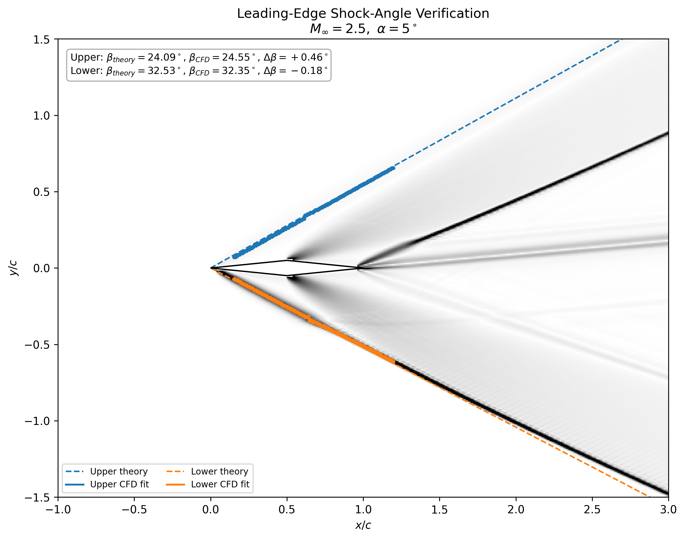
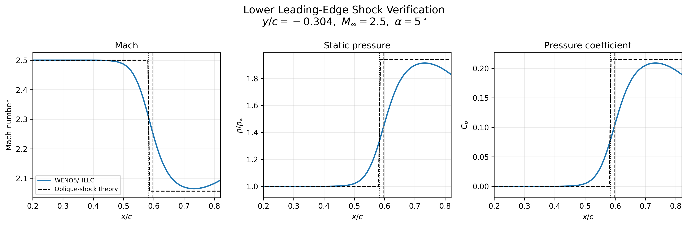
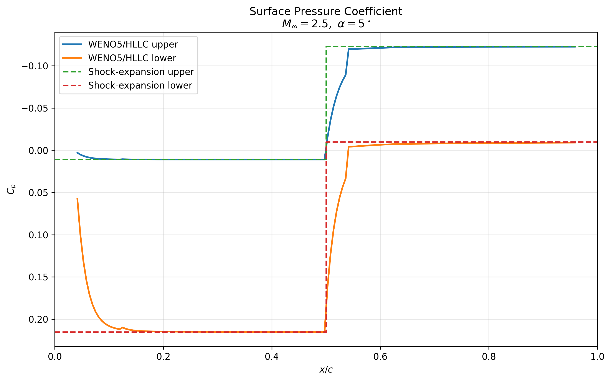
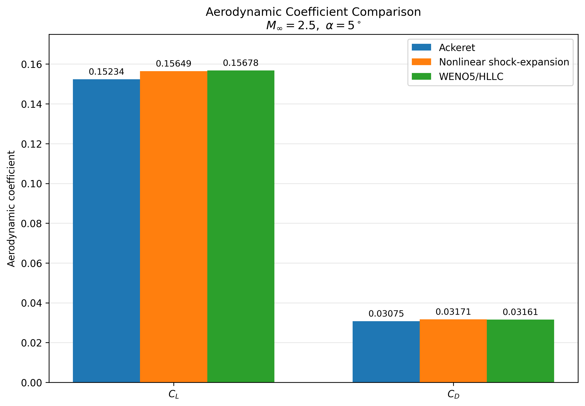
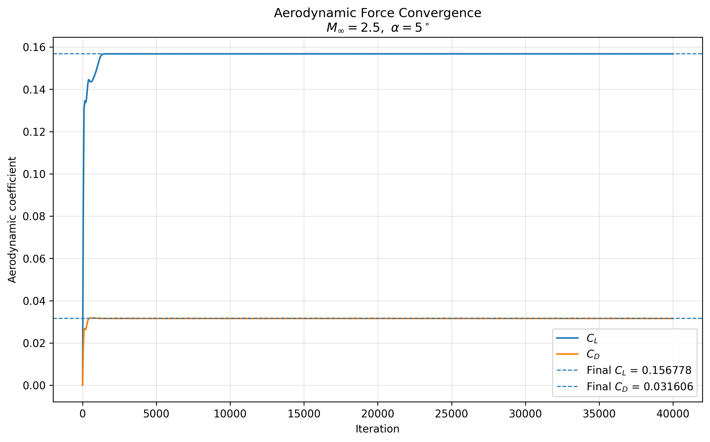

# Supersonic Diamond Airfoil CFD at Mach 2.5

**From compressible-flow theory to a custom C++ shock-capturing solver and an ongoing wall-resolved SA-RANS study**

This project studies a two-dimensional diamond airfoil at Mach 2.5 and 5° angle of attack.

The geometry creates a clear system of compression waves, oblique shocks and Prandtl-Meyer expansions. This makes it a useful case for checking whether a numerical solution recovers the physics predicted by classical compressible-flow theory [1].

I developed a custom C++ finite-volume Euler solver using HLLC intercell fluxes [2,3], WENO5-JS reconstruction [4] and SSP-RK3 time integration [5]. The airfoil is represented on a Cartesian grid using an immersed-boundary treatment [8].

## Numerical development of the wave field

<p align="center">
  
</p>

<p align="center">
  <em>Evolution of the numerical schlieren field from the initial transient towards the established Mach 2.5 shock-expansion structure.</em>
</p>

I do not accept a solution only because lift and drag become stable.

I also check the shock angles, Rankine-Hugoniot states, Prandtl-Meyer expansion states, surface pressure, off-body wave structure and integrated aerodynamic forces against independent analytical references [1].

> **Main engineering question:**  
> Does the same aerodynamic conclusion survive when the modelling fidelity is increased?

---

## 1. Why this problem?

A diamond airfoil is simple geometrically, but the flow physics are not.

At supersonic speed, each change in surface direction creates either a compression or an expansion.

For this case:

- the leading edges generate attached oblique shocks;
- the mid-chord corners generate expansion waves;
- the upper and lower surfaces experience different pressure states because the airfoil is at 5° incidence;
- those pressure differences create lift, wave drag and pitching moment.

The important advantage is that these states can be calculated independently using oblique-shock and Prandtl-Meyer theory [1].

That gives me a reference outside the CFD solver.

The solver therefore has to do more than produce a smooth-looking flow field. It has to recover the correct wave system and produce aerodynamic forces that are consistent with that physics.

---

## 2. Reference case

| Quantity | Value |
|---|---:|
| Geometry | 2D diamond airfoil |
| Chord, `c` | 1.0 m |
| Thickness ratio, `t/c` | 0.10 |
| Freestream Mach number | 2.5 |
| Angle of attack | 5° |
| Ratio of specific heats, `γ` | 1.4 |
| Gas constant, `R` | 287 J kg⁻¹ K⁻¹ |
| Freestream pressure | 101325 Pa |
| Freestream temperature | 288.15 K |
| Freestream velocity | 850.657 m/s |
| Euler reference grid | 720 × 360 |
| RANS chord Reynolds number | approximately 5.82 × 10⁷ |

---

## 3. Solver development

### 3.1 Euler formulation

The inviscid branch solves the two-dimensional compressible Euler equations in conservative form,

```math
\frac{\partial \mathbf{U}}{\partial t}
+
\frac{\partial \mathbf{F}}{\partial x}
+
\frac{\partial \mathbf{G}}{\partial y}
=0,
```
### 3.2 Why I moved beyond Rusanov
Rusanov was useful as a robust starting point.

It uses a single maximum signal speed and adds relatively strong numerical dissipation. This makes it simple and stable, but the same dissipation can smear shocks and contact structures [2].

My earlier compressible-flow studies showed this behaviour directly. Rusanov remained robust, while HLLC recovered discontinuous wave structure more accurately.

For this airfoil, that difference matters.

The pressure change across each wave contributes directly to the aerodynamic force. If the numerical method smears the shock too strongly, it can also change the surface pressure and therefore the predicted wave drag and lift.

So I moved to HLLC.

---

### 3.3 HLLC flux

HLLC restores the intermediate contact wave that is missing from the simpler two-wave HLL representation [2,3].

The approximate wave system contains

```math
S_L,\qquad S_*,\qquad S_R.
```
### 3.4 Barth-Jespersen reconstruction

Before moving to WENO5-JS, I developed an HLLC solver using Barth-Jespersen limited reconstruction [6].

The limiter allows higher-order reconstruction in smooth regions, but reduces the reconstruction close to strong gradients where non-physical oscillations can appear.

This gave me an important intermediate solver:

**HLLC + Barth-Jespersen**

I used this branch to check the HLLC flux, pressure field, force integration and convergence behaviour before adding the more expensive WENO5-JS reconstruction.

The final integrated lift and drag from this branch were effectively the same as the later WENO5-HLLC solution.

That was useful evidence: changing the reconstruction changed the local numerical treatment, but did not change the final aerodynamic loading at the reported precision.

### 3.5 Why WENO5-JS?

The flow contains two very different numerical regions.

In smooth parts of the domain, I want high-order accuracy.

Across shocks, the solution is discontinuous and a normal high-order reconstruction can create non-physical oscillations.

WENO5-JS handles this by reconstructing the solution from several candidate stencils. In smooth regions, the stencils combine to recover fifth-order accuracy. Close to a discontinuity, the nonlinear weights reduce the influence of stencils that cross the shock [4].

For this problem, that matters because I need to preserve:

- the leading-edge compression waves;
- the sharp pressure rise across the oblique shocks;
- the mid-chord expansion structure;
- the pressure distribution that produces wave drag and lift.

I therefore moved from the limited HLLC branch to WENO5-JS when the improvement in local wave resolution justified the additional computational cost.

The final Euler solver uses:

```text
Finite-volume conservation
        ↓
WENO5-JS reconstruction
        ↓
HLLC intercell flux
        ↓
SSP-RK3 time integration
```

### 3.6 Build and run

The Euler solver is written in C++17 and uses only the standard library.

Compile from the repository root with:

```bash
g++ -O3 -std=c++17 src/euler_solver/main.cpp -o diamond_solver
```

Run the reference case with:

```bash
./diamond_solver \
    --max-iters 40000 \
    --min-iters 40000 \
    --output results/euler/reference
```

The default solver configuration already contains the reference condition described in Section 2: Mach 2.5, 5° angle of attack, `t/c = 0.10` and the `720 × 360` Cartesian grid.

Available runtime options can be viewed with:

```bash
./diamond_solver --help
```

---

## 4. WENO5-HLLC flow field

The final Euler solution recovers the expected asymmetric supersonic wave system.

At the leading edge, both surfaces turn the flow towards the body and create attached oblique shocks.

Because the airfoil is at 5° angle of attack, the effective turning angle is different on the two sides:

- the lower forward surface produces the stronger compression;
- the upper forward surface produces the weaker compression.

The pressure rise is therefore much larger on the lower forward panel.

At the mid-chord corners, the surfaces turn away from the local flow. The compressed flow then expands through Prandtl-Meyer fans before leaving the trailing edge.

This creates the main aerodynamic loading pattern:

**strong lower-surface compression + upper-surface pressure reduction → positive lift**

while the streamwise component of the pressure loading produces wave drag.

The important point is that I do not start by looking at the final `C_D` and `C_L`.

I first ask whether the solver has produced the correct physical wave system.

> **A correct force coefficient with the wrong shock or expansion structure would not be an acceptable solution.**

The next checks therefore compare the numerical wave field directly with analytical compressible-flow theory.

---

## 5. Verification against compressible-flow theory

I use several independent checks because no single CFD quantity is enough to prove that the full solution is physically correct.

The first check is the leading-edge shock geometry.

### 5.1 Leading-edge shock verification

For the symmetric diamond geometry,

```text
thickness ratio, t/c = 0.10
half angle, δ         = atan(0.10)
                      ≈ 5.71 deg
```

At `α = 5°`, the upper and lower forward panels experience different effective compression turns:

```text
upper surface turning angle ≈ 0.71 deg
lower surface turning angle ≈ 10.71 deg
```

The lower surface therefore produces the substantially stronger leading-edge compression.

For an attached oblique shock, the shock angle `β` is obtained from the nonlinear `θ-β-M` relation,

```math
\tan\theta
=
2\cot\beta
\left[
\frac{M_\infty^2\sin^2\beta-1}
{M_\infty^2(\gamma+\cos 2\beta)+2}
\right].
```

Using the weak-shock solution gives:

| Surface | Turning angle, `θ` | Theory shock angle, `β` |
|---|---:|---:|
| Upper forward panel | 0.71° | 24.09° |
| Lower forward panel | 10.71° | 32.53° |

The corresponding Rankine-Hugoniot states are:

| Quantity | Upper shock | Lower shock |
|---|---:|---:|
| `θ` | 0.71° | 10.71° |
| `β` | 24.09° | 32.53° |
| `Mn1` | 1.020 | 1.344 |
| `p2/p1` | 1.048 | 1.942 |
| `ρ2/ρ1` | 1.034 | 1.593 |
| `T2/T1` | 1.014 | 1.219 |
| `M2` | 2.470 | 2.056 |
| `p2` | 106.2 kPa | 196.8 kPa |

The upper shock is weak because the local flow turning is only about `0.71°`. The lower surface turns the flow by approximately `10.71°`, producing a much stronger pressure rise and a larger reduction in Mach number.

The analytical shock-angle prediction was then compared directly with the numerical solution.

The numerical shock location was extracted from maxima in the density-gradient field. A straight line was fitted through the detected ridge of each leading-edge shock, giving:

| Shock | Theory `β` | WENO5-JS + HLLC `β` | Difference |
|---|---:|---:|---:|
| Upper leading edge | 24.09° | 24.55° | +0.46° |
| Lower leading edge | 32.53° | 32.35° | -0.18° |

<p align="center">
  
</p>

The extracted upper shock differs from theory by approximately `+0.46°`, while the lower shock differs by approximately `-0.18°`.

Both numerical shock angles therefore lie within **0.5°** of the nonlinear oblique-shock prediction.

The comparison is based on the resolved density-gradient ridge rather than a manually drawn line. The remaining difference is consistent with the finite numerical shock thickness, Cartesian-grid resolution and the finite spatial interval over which the numerical ridge is fitted.

The stronger lower shock was also checked using an off-body horizontal cut through the numerical solution at approximately `y/c = -0.304`.

<p align="center">
  
</p>

Across this cut, the numerical solution is compared with the ideal Rankine-Hugoniot post-shock state in terms of Mach number, pressure ratio and pressure coefficient.

The analytical shock is a mathematical discontinuity, while the finite-volume calculation captures the transition over a finite number of cells. Away from this captured shock thickness, the numerical solution approaches the theoretical post-shock state closely.

The leading-edge verification therefore checks both **where the shock forms** and **whether the state behind it is physically correct**:

```text
local flow turning
        ↓
theoretical shock angle
        ↓
numerically extracted shock angle
        ↓
post-shock Mach and pressure state
        ↓
surface-pressure loading
```

> **The WENO5-JS + HLLC solution recovers the upper and lower leading-edge shock angles to within 0.5° of nonlinear oblique-shock theory while also reproducing the expected post-shock states.**

### 5.2 Expansion-state verification

At the mid-chord corners, both surfaces turn through

```math
\Delta\theta = 2\delta \approx 11.42^\circ,
```

producing Prandtl-Meyer expansion fans.

Although the geometric turning is the same on both sides, the flow entering each expansion is different because of the unequal leading-edge shocks established in Section 5.1.

| Quantity | Upper surface | Lower surface |
|---|---:|---:|
| Mach before expansion | 2.470 | 2.056 |
| Expansion angle | 11.42° | 11.42° |
| Mach after expansion | 3.004 | 2.509 |
| Pressure ratio across expansion | 0.441 | 0.493 |
| Rear-panel pressure | 46.85 kPa | 96.95 kPa |

The upper expansion accelerates the flow to approximately **Mach 3.00**, producing the strongest pressure reduction in the solution. The lower rear-panel pressure remains much higher because its expansion begins from the strongly compressed lower-surface state.

These analytical states provide the reference for the numerical pressure loading examined next.

> **The solver must preserve the different states created by the leading-edge shocks as the flow passes through the two expansion fans.**

### 5.3 Surface-pressure verification

The analytical shock and expansion states give the following panel pressure coefficients:

| Panel | Analytical `Cp` |
|---|---:|
| Upper forward | +0.0110 |
| Lower forward | +0.2153 |
| Upper rear | -0.1229 |
| Lower rear | -0.0099 |

The numerical surface-pressure distribution is compared with both Ackeret theory and the nonlinear shock-expansion solution.

<p align="center">
  
</p>

The WENO5-JS + HLLC solution reproduces the expected pressure-loading pattern: strong compression on the lower forward panel and the largest pressure reduction on the upper rear panel.

Because the airfoil is represented using a Cartesian immersed boundary, the numerical values are taken from the nearest external fluid cells rather than body-fitted wall faces. They should therefore be interpreted as a **nearest-fluid-cell pressure proxy**, particularly close to the sharp corners where the analytical solution changes discontinuously.

Away from these local corner regions, the numerical pressure levels follow the nonlinear shock-expansion prediction closely.

> **The resolved surface pressure provides the link between the local wave structure and the integrated lift and wave drag.**

### 5.4 Integrated-force verification

The final analytical check is whether the verified shock-expansion pressure field produces the correct integrated aerodynamic forces.

For the reference case, the final WENO5-JS + HLLC Euler solution gives

```math
C_D = 0.031606,
\qquad
C_L = 0.156778.
```

The numerical result is compared with both Ackeret linear theory and the nonlinear shock-expansion solution:

| Method | `Cd` | `Cl` |
|---|---:|---:|
| Ackeret linear theory | 0.030752 | 0.152345 |
| Nonlinear shock-expansion theory | 0.031714 | 0.156485 |
| WENO5-JS + HLLC Euler | **0.031606** | **0.156778** |

Relative to Ackeret linear theory,

```math
\Delta C_D
=
\frac{C_{D,\mathrm{CFD}}-C_{D,\mathrm{Ackeret}}}
{C_{D,\mathrm{Ackeret}}}\times100
\approx +2.78\%,
```

```math
\Delta C_L
=
\frac{C_{L,\mathrm{CFD}}-C_{L,\mathrm{Ackeret}}}
{C_{L,\mathrm{Ackeret}}}\times100
\approx +2.91\%.
```

Ackeret theory provides a useful linearised reference, but the present airfoil contains finite compression and expansion turning angles. The nonlinear shock-expansion solution is therefore the more appropriate reference for the final quantitative comparison.

Relative to nonlinear shock-expansion theory,

```math
\Delta C_D
=
\frac{0.03160637093-0.03171356478}
{0.03171356478}\times100
\approx -0.338\%,
```

```math
\Delta C_L
=
\frac{0.15677811494-0.15648527219}
{0.15648527219}\times100
\approx +0.187\%.
```

The WENO5-JS + HLLC solution therefore agrees with nonlinear shock-expansion theory to approximately **0.34% in drag** and **0.19% in lift**.

<p align="center">
  
</p>

This force agreement is not treated as an isolated verification result. The same numerical solution has already been examined through the complete compressible-flow chain:

- leading-edge shock angles;
- Rankine-Hugoniot post-shock states;
- Prandtl-Meyer expansion states;
- off-body shock structure;
- surface-pressure loading.

The relationship between these checks is

```text
shock and expansion geometry
            ↓
local thermodynamic states
            ↓
surface-pressure distribution
            ↓
integrated lift and wave drag
```

The integrated aerodynamic coefficients are therefore the final consequence of the resolved wave system and pressure loading rather than standalone numerical targets.

> **The WENO5-JS + HLLC solution reproduces the nonlinear shock-expansion prediction to approximately 0.34% in drag and 0.19% in lift, while independently recovering the wave structure and pressure states responsible for those forces.**
> 
## 6. Numerical convergence and robustness

Agreement with theory is only useful if the numerical solution itself is sufficiently settled.

For the final WENO5-JS + HLLC calculation, convergence was monitored using both the residual history and the integrated aerodynamic forces.

### 6.1 Convergence assessment

The final WENO5 JS + HLLC calculation was continued to **40,000 iterations**.

The integrated aerodynamic coefficients became stationary well before the end of the run:

```math
C_D = 0.03160637093,
\qquad
C_L = 0.15677811494.
```

<p align="center">
  
</p>

The final 12 recorded force samples are identical at the precision stored in the force history:

| Quantity | Final value | Range over final 12 samples |
|---|---:|---:|
| `Cd` | 0.03160637093 | 0 |
| `Cl` | 0.15677811494 | 0 |

The cellwise residual and solution change histories remain oscillatory at late iterations and do not provide standalone evidence of convergence. Their history is therefore retained in `figures/diagnostics/` as a numerical diagnostic rather than used as the primary convergence result.

Convergence of the reference solution is assessed from the stationary aerodynamic coefficients together with the independently verified shock geometry, pressure states and surface loading.

> **The final aerodynamic loading is stationary, while the residual history is reported separately and interpreted as a diagnostic rather than a convergence claim.**

### 6.2 Robustness to reconstruction method

Before the final WENO5-JS formulation, the HLLC solver was tested with Barth-Jespersen limited reconstruction.

Both reconstruction approaches produced essentially the same integrated aerodynamic loading, while WENO5-JS resolved the local shock-expansion structure more sharply.

| Solver branch | Main role | Integrated loading |
|---|---|---|
| HLLC + Barth-Jespersen | Intermediate verification branch | Consistent with final solution |
| WENO5-JS + HLLC | Final reference solver | `Cd = 0.031606`, `Cl = 0.156778` |

This provides a useful robustness check: changing the reconstruction altered the local resolution of discontinuities without changing the aerodynamic conclusion.

> **WENO5-JS was retained because it improved wave resolution, not because it produced a different lift or drag result.**
### 6.3 Sharp edge and immersed-boundary limitation

The diamond airfoil has ideal zero-radius leading and trailing edges.

On the Cartesian immersed-boundary grid, these corners cannot be represented as exact body-fitted surface points. The local pressure and gradient fields very close to the corners are therefore more sensitive to the discrete body representation than the flow away from the surface.

For this reason, isolated values taken directly at a sharp corner are not used as standalone evidence. The solution is assessed using the surrounding shock and expansion structure, surface-pressure behaviour away from the vertices, analytical state checks and integrated aerodynamic forces.

## 7. Increasing the modelling fidelity: wall-resolved SA-RANS

The Euler solver establishes the inviscid shock-expansion physics, but it cannot predict skin friction or the interaction between the boundary layer and the pressure field.

The next stage therefore repeats the same Mach 2.5, `α = 5°` case using compressible wall-resolved RANS in OpenFOAM with the Spalart-Allmaras turbulence model [7].

The purpose is not simply to generate another CFD result.

The question is whether the main aerodynamic conclusion remains consistent when viscous physics are introduced.

### 7.1 Current RANS status

The SA-RANS calculation is still being converged, so no final viscous coefficient is reported yet.

At iteration `15000`, the monitored aerodynamic coefficients are:

| Quantity | Value |
|---|---:|
| `Cd` | 0.035215 |
| Pressure drag, `Cd,p` | 0.029793 |
| Viscous drag, `Cd,v` | 0.005422 |
| `Cl` | 0.137125 |
| `Cm` | -0.022348 |
| `L/D` | 3.894 |

The wall resolution at this stage is:

| Quantity | Value |
|---|---:|
| Minimum `y+` | 0.200 |
| Average `y+` | 0.381 |
| Maximum `y+` | 1.617 |

The near-wall resolution therefore remains appropriate for the wall-resolved SA treatment.

However, the force history shows that the solution is still evolving.

Between iterations `8000` and `15000`:

| Quantity | Iteration 8000 | Iteration 15000 | Change |
|---|---:|---:|---:|
| `Cd` | 0.034278 | 0.035215 | +2.73% |
| `Cd,p` | 0.027900 | 0.029793 | +6.78% |
| `Cd,v` | 0.006378 | 0.005422 | -14.99% |
| `Cl` | 0.134790 | 0.137125 | +1.73% |
| `Cm` | -0.024255 | -0.022348 | -7.86% in magnitude |

The longer calculation therefore shows that the apparent pressure-force stationarity observed near iteration `8000` was premature.

The pressure contribution has moved upward while the viscous contribution has continued to decrease.

> **The RANS reference is therefore still provisional and will only be accepted when pressure drag, viscous drag, lift and pitching moment are simultaneously stationary.**

### 7.2 Current cross-fidelity observation

The converged Euler reference gives

```math
C_D = 0.031606.
```

Because the Euler calculation contains no wall-shear contribution, this drag is entirely pressure generated.

At iteration `15000`, the RANS pressure contribution is

```math
C_{D,p} = 0.029793,
```

approximately `5.74%` below the Euler value.

The RANS calculation also contains a viscous contribution,

```math
C_{D,v} = 0.005422,
```

giving

```math
C_D = 0.035215.
```

The total RANS drag is therefore approximately `11.42%` above the Euler result.

```text
Euler
Cd = 0.031606
pressure loading only
        ↓
viscous RANS
        ↓
Cd,p = 0.029793
Cd,v = 0.005422
        ↓
Cd = 0.035215
```

The lower RANS pressure contribution is treated as an observation rather than evidence of agreement with the Euler solution.

Its physical origin will be assessed after convergence using the surface-pressure distribution, shock structure and boundary-layer behaviour.

> **The final Euler-RANS comparison will be based on the converged pressure and viscous force components together with the flow physics responsible for them.**

## 8. From verified RANS baseline to aerodynamic design

The wall-resolved SA-RANS case is being used to establish the viscous reference solution for the next stage of the project.

The objective is not to begin a parameter sweep as soon as the solver appears stable.

The reference case must first be converged, checked for domain sensitivity and then frozen as the production CFD setup.

### 8.1 Prove domain independence

Once the large-domain reference case has converged, a smaller candidate domain will be created and warm-started from the established solution.

The purpose is to determine whether the far-field boundaries can be moved closer without changing the aerodynamic result.

The two domains will be compared using:

```math
C_D,\quad
C_{D,p},\quad
C_{D,v},\quad
C_L,\quad
C_m,
```

together with

```math
C_p(x/c),\quad
y^+(x/c),\quad
\tau_w(x/c),
```

and the position and strength of the principal shock system.

If the smaller domain reproduces the reference solution within the adopted tolerances, it will become the production domain for the remaining study.

This avoids carrying unnecessary computational cost into every subsequent case while preserving the validated flow physics.

### 8.2 Freeze the production CFD setup

After the domain-independence check, the accepted numerical setup will be frozen.

The same production methodology will then be retained across the design study so that changes in aerodynamic performance can be attributed to the operating condition or geometry rather than to changes in the CFD setup.

The frozen configuration will define the common:

- computational domain;
- meshing strategy;
- near-wall resolution;
- turbulence model;
- numerical schemes;
- boundary conditions;
- force and moment definitions;
- convergence criteria;
- post-processing procedure.

> **Once the baseline methodology is verified, the solver setup stops being another design variable.**

### 8.3 Controlled angle-of-attack sweep

The first production study will be a controlled angle-of-attack sweep.

The aim is to determine how incidence changes the complete shock-boundary-layer-pressure system rather than looking only at the final force coefficients.

For each incidence, the study will track:

- leading-edge shock angle and strength;
- expansion behaviour;
- surface-pressure redistribution;
- boundary-layer response;
- `Cl`, `Cd` and `Cm`;
- pressure and viscous drag contributions;
- lift-to-drag ratio.

The same verification logic used for the reference case will be retained throughout the sweep.

```text
angle of attack
      ↓
local flow turning
      ↓
shock and expansion strength
      ↓
boundary-layer response
      ↓
surface pressure and skin friction
      ↓
Cl, Cd and Cm
```

### 8.4 Geometry optimisation

Only after the baseline and incidence behaviour are understood will the geometry be varied.

The optimisation will investigate whether the shock-expansion system can be reshaped to improve aerodynamic performance without creating an unacceptable penalty elsewhere.

Candidate design variables include:

| Design variable | Main aerodynamic effect |
|---|---|
| Thickness ratio, `t/c` | Changes panel angle and compression strength |
| Maximum-thickness location | Changes the position of compression and expansion waves |
| Forward-panel angle | Controls leading-edge compression |
| Rear-panel angle | Controls expansion and rear-panel pressure recovery |
| Angle of attack | Changes the balance between the upper and lower wave systems |

Performance will not be judged from drag alone.

Changes in lift, wave drag, viscous drag, pitching moment, shock structure and boundary-layer behaviour will all be considered.

A candidate will only be treated as an improvement if the aerodynamic benefit remains physically consistent with the verified flow solution.

### 8.5 Final verification of the optimum

The best-performing geometry will not be accepted directly from the optimisation loop.

It will be rerun using the validated production CFD methodology and subjected to the same convergence and physics checks used for the reference configuration.

The complete engineering sequence is therefore:

```text
establish converged RANS reference
              ↓
prove domain independence
              ↓
freeze production CFD setup
              ↓
run controlled AoA sweep
              ↓
optimise geometry
              ↓
rerun validated CFD on the optimum
```

> **The optimisation begins only after the numerical method has stopped being the main uncertainty.**

---

## References

[1] J. D. Anderson Jr., *Modern Compressible Flow: With Historical Perspective*, 3rd ed., McGraw-Hill, 2003.

[2] E. F. Toro, *Riemann Solvers and Numerical Methods for Fluid Dynamics: A Practical Introduction*, 3rd ed., Springer, 2009.

[3] E. F. Toro, M. Spruce and W. Speares, “Restoration of the contact surface in the HLL-Riemann solver,” *Shock Waves*, Vol. 4, pp. 25–34, 1994. https://doi.org/10.1007/BF01414629

[4] G.-S. Jiang and C.-W. Shu, “Efficient implementation of weighted ENO schemes,” *Journal of Computational Physics*, Vol. 126, No. 1, pp. 202–228, 1996. https://doi.org/10.1006/jcph.1996.0130

[5] C.-W. Shu and S. Osher, “Efficient implementation of essentially non-oscillatory shock-capturing schemes,” *Journal of Computational Physics*, Vol. 77, No. 2, pp. 439–471, 1988. https://doi.org/10.1016/0021-9991(88)90177-5

[6] T. J. Barth and D. C. Jespersen, “The design and application of upwind schemes on unstructured meshes,” AIAA Paper 89-0366, 27th Aerospace Sciences Meeting, 1989. https://doi.org/10.2514/6.1989-366

[7] P. R. Spalart and S. R. Allmaras, “A one-equation turbulence model for aerodynamic flows,” AIAA Paper 92-0439, 30th Aerospace Sciences Meeting and Exhibit, 1992. https://doi.org/10.2514/6.1992-439

[8] R. Mittal and G. Iaccarino, “Immersed Boundary Methods,” *Annual Review of Fluid Mechanics*, Vol. 37, pp. 239–261, 2005. https://doi.org/10.1146/annurev.fluid.37.061903.175743
